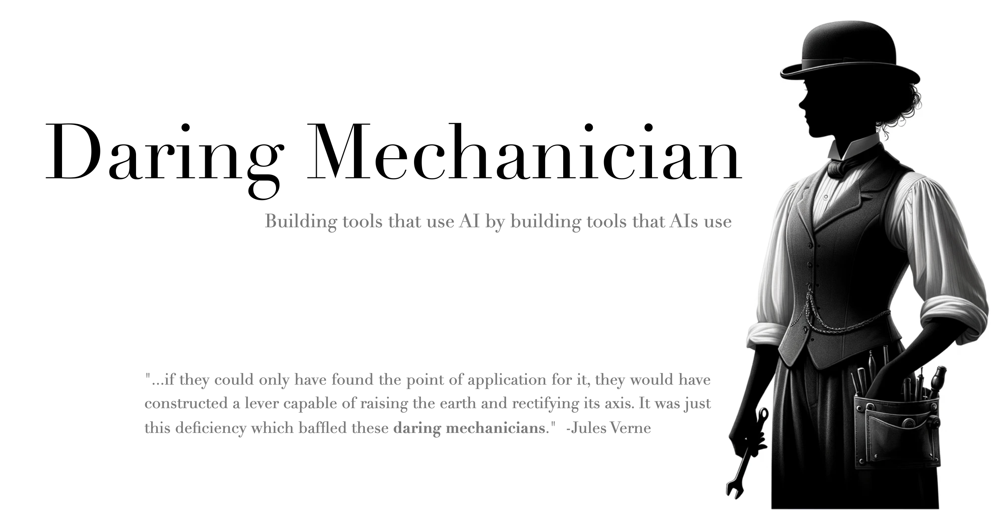
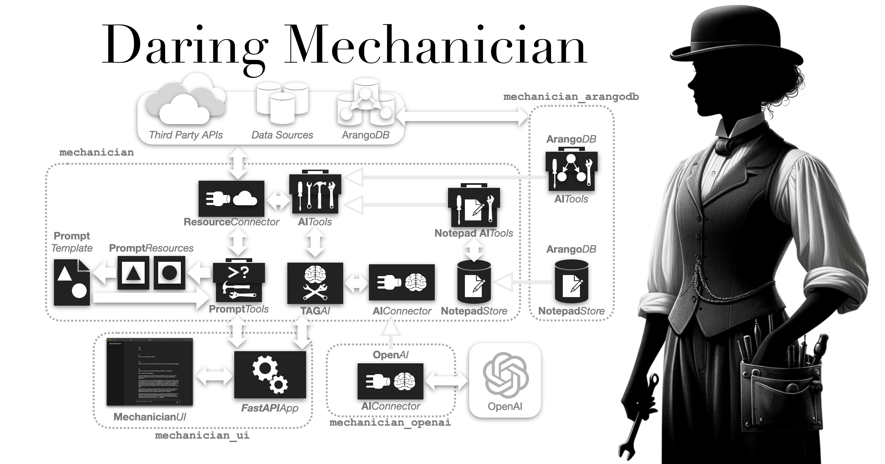

<!--  -->


<p style="clear: both; margin-top: 0; font-family: 'Tratatello', serif; color: darkgrey;">

>*"...if they could only have found the point of application for it, they would have constructed a lever capable of raising the earth and rectifying its axis. It was just this deficiency which baffled these **daring mechanicians**."*  -Jules Verne, *From the Earth to the Moon* (1865)


The [**Daring Mechanician** ](https://github.com/liebke/mechanician) project provides several Python packages for building Generative AI-enabled applications where the AIs themselves are provided tools to use, an approach that can be described as **Tool Augmented Generation** (**TAG**), and the tool-wielding Generative AIs can be described as **Tool Augmented Generative AIs** (**TAG AIs**).

The core `mechanician` package provides modules for building, testing, and tuning *TAG AIs* and the tools that these AIs use, including support for AI-driven testing and AI-assisted *tuning* of the instruction sets given to an AI that we call **Instruction Auto-Tuning** (IAT). 

The `mechanician-openai` package provides `AIConnectors` for both OpenAI's *Chat* API and *Assistants* API, and there are plans to create connectors for more LLMs with *tool-call* support, especially local LLMs.

The `mechanician-arangodb` module provides `AITools` that let AIs interact with the [ArangoDB](https://arangodb.com) graph database.


# Tool Augmented Generation (TAG)

Foundation Models are inherently limited by the scope of their training data and the static nature of that data, **Tool Augmented Generation** (**TAG**) provides AIs with tools that let them interact with databases, APIs, and code libraries, enhancing their knowledge and capabilities and giving them access to up-to-date information, the ability to perform computations, and to interact with external systems, and can provide them a form of memory that spans multiple *context windows*, like what OpenAI announced [here](https://openai.com/blog/memory-and-new-controls-for-chatgpt).

In contrast to **Retrieval Augmented Generation** (RAG), which uses a knowledge base to retrieve information and augment the *prompt* sent to an AI, **Tool Augmented Generative AIs** can retrieve information themselves, and also perform actions across multiple systems, databases, and APIs, extending *Generative AIs* from pure knowledge repositories to active participants in information processing and generation.

>NOTE: You can build a RAG application using a TAG AI to create a **RAGTAG AI** Application.

*TAG* leverages the "**Function Calling**", or "**Tool Calling**", capabilities available in several Large Language Models, including *OpenAI's GPT*, and is meant to complement other approaches to augmenting Foundation Models, like **Retrieval Augmented Generation** (RAG) and **Fine Tuning** (FT). 


## Designing Tools for AIs to Use

TAG AIs can be observed performing multi-step problem solving, driven by the feedback provided by their tools, and learning to use those tools effectively through that feedback, so it is necessary for the tools to provide effective feedback, often through natural language, when reporting errors or providing results.

Generative AIs will learn from their mistakes and successes, if the tools provide feedback that the AI can learn from.

See [Getting Started with Daring Mechanician](#getting-started-with-daring-mechanician) for an example of how to build a **Tool Augmented Generative AI** (TAG AI).


## Instruction Tuning (IT)

In addition to learning from the feedback provided by the tools they use, TAG AIs can learn from the feedback they receive from users.

But since TAG AIs do not necessarily undergo further training, or Fine Tuning, that permanently encodes what they learned, they can only learn within the *context window* where feedback is received, and must start from scratch during the next session.

In order to make these learned behaviors persistent, they must be captured through a process of **Instruction Tuning**, or *prompt engineering*, where the initial instructions provided to the AI, the instructions provided for the tools the AI can use, and the feedback provided by those tools are revised and improved, incorporating lessons learned during interactions with users.

This process starts with creating an initial set of *AI Instructions*, *Tool Instructions*, and *Tool Feedback*, that are used to guide the AI's behavior and responses, and then iteratively refining those instructions and tool feedback based on the AI's performance during interactions with users.

At the start of this process, the prompting provided to the AI often consists of explicit and detailed steps, but as the process proceeds, you sometimes discover that the AI doesn't need such detailed prompting, and that more general prompting approach can be used, letting it will work out the details on its own, and other times you discover the reverse where the AI makes incorrect assumptions, and more explicit prompting is required.

In order to speed up this process, it is useful to use an **Evaluator AI** that acts as an *user surrogate*, interactively eliciting responses from the AI as the two work through multi-step tasks. See [Getting Started with AI-Driven Testing](#getting-started-with-ai-driven-testing) for more information on *Evaluator AIs*.

## Instruction Auto-Tuning (IAT)

By observing an AI's interactions with users and other AIs, an *Instructor AI* can refine and update the AI's current instructions and the instructions describing the tools the AI can use.

The Instructor AI is given the AI's current set of instructions, instructions for the tools used by the AI, and the transcript of interactions between the AI and a User (or Evaluator AI), including the AI *tool calls* and responses.

See [Getting Started with Instruction Auto-Tuning](#getting-started-with-instruction-auto-tuning) for an example of how to use the **Instruction Auto-Tuning** (IAT) process to refine the instructions for a **Movie Database Assistant**.


## AI-Driven Testing

See [Getting Started with AI-Driven Testing](#getting-started-with-ai-driven-testing) for an example of how to use the **AI-Driven Testing** process.

## Getting Started Guide: Table of Contents

  - [Getting Started with Daring Mechanician](#getting-started-with-daring-mechanician)
    - [TAGAI Class](#tagai-class)
    - [AITools Abstract Class](#aitools-abstract-class)
    - [Instruction Sets](#instruction-sets)
      - [AI Instructions](#ai-instructions)
      - [Tool Instructions](#tool-instructions)
    - [AIConnector Classes](#aiconnector-classes)
      - [OpenAI Connectors](#openai-connectors)
      - [OpenAIChatConnector](#openaichatconnector)
      - [OpenAIAssistantsConnector](#openaiassistantsconnector)
      - [AzureOpenAIChatConnector](#azureopenaichatconnector)
    - [Running the AI](#running-the-ai)
  - [Getting Started with Instruction Auto-Tuning](#getting-started-with-instruction-auto-tuning)
  - [Getting Started with AI-Driven Testing](#getting-started-with-ai-driven-testing)
    - [AI Q&A Program Tests](#ai-q&a-program-tests)
    - [AI Task Evaluations](#ai-task-evaluations)
    - [Run AI-Driven Tests](#run-ai-driven-tests)
  - [Getting Started with Mechanician ArangoDB](#getting-started-with-mechanician-arangodb)
      - [Run ArangoDB in Docker](#run-arangodb-in-docker)
  - [Getting Started with the TMDb Example](#getting-started-with-the-tmdb-example)
    - [Example Interaction](#example-interaction)
    - [TMDb Example Code](#tmdb-example-code)
  - [Getting Started with the Arango Movie Database Example](#getting-started-with-the-arango-movie-database-example)
    - [Arango Movie Database Example Code](#arango-movie-database-example-code)
  - [Parallel Tool Calls and Streaming Responses](#parallel-tool-calls-and-streaming-responses)
    - [Environment Variables](#environment-variables)
  - [Notepads](https://github.com/liebke/mechanician/tree/main/examples/notepad#readme)


## Getting Started with Daring Mechanician

**Daring Mechanician** consists of the following packages:

* [mechanician](https://github.com/liebke/mechanician/tree/main/packages/mechanician): the core package for building, running, and testing **Tool Augmented Generative AI** (TAG AI) applications.

* [mechanician-openai](https://github.com/liebke/mechanician/tree/main/packages/mechanician_openai): provides *AIConnector* classes for connecting to the *OpenAI Chat API* and the *OpenAI Assistants API*.

* [mechanician-arangodb](https://github.com/liebke/mechanician/tree/main/packages/mechanician_arangodb): provides an *AITools* class that lets AIs interact with the [ArangoDB](https://arangodb.com) graph database.

The roadmap includes more *AIConnectors* for connecting to different LLMs, and more *AITools* that let AIs interact with different systems.


### Example Projects

To run the example projects, you'll need to install *mechanician-openai* to connect to an OpenAI GPT, and you will also need an [OpenAI API Key(https://openai.com/product#made-for-developers)]. 

You can install it using pip:

```bash
pip install mechanician-openai
```

The [```examples```](https://github.com/liebke/mechanician/tree/main/examples) directory contains examples of **Tool Augmented Generative AI** projects.

* [examples/tmdb](https://github.com/liebke/mechanician/tree/0f5b4a9d344f384499d2ed9aa01b0115f60c2acb/examples/tmdb) is an example of a **The Movie Database (TMDb) Assistant** that uses the *OpenAI Chat API* to answer questions about movies and their casts and crews.

* [examples/arango_movie_db](https://github.com/liebke/mechanician/blob/0f5b4a9d344f384499d2ed9aa01b0115f60c2acb/examples/arango_movie_db) is an example of a **Movie Document Database Assistant** that uses the [ArangoDB](https://arangodb.com) to record information on movies, their casts, and reviews.


## The Core Classes and Concepts

The next few sections will cover the core classes and concepts used to build and run **Tool Augmented Generative AI** (TAG AI) applications.

* TAGAI Class
* AITools Abstract Class
* Instruction Sets
* AIConnector Classes
* Mechanician Shell


### TAGAI Class

The TAGAI class is used to create instance of a **Tool Augmented Generative AI**.

```python
from mechanician import TAGAI

ai = TAGAI(ai_connector=ai_connector,
           ai_instructions=ai_instructions,
           tool_instructions=tool_instructions,
           ai_tools=tools)
```

Alternatively, you can pass an `instruction_set_directory` to the constructor, and it will load the the *ai_instructions* and *tool_instructions* from the designated directory. 


```python
ai = TAGAI(ai_connector=OpenAIChatConnector(),
           instruction_set_directory="./instructions",
           ai_tools=tools)
```


The `TAGAI` class takes the following parameters:

* [AIConnector](#aiconnector-classes): Provides a connection to an LLM API, such as the OpenAI Chat API or the OpenAI Assistants API.

* [AITools](#aitools-abstract-class): Provides a set of tools that the AI can use to interact with other systems, databases, and interfaces.

* [Instruction Set Directory](#instruction-sets): The directory containing the instruction for the TAG AI, describing its role and behaviors, and the instructions for the tools used by the AI.


Here are some examples of how to use the `TAGAI` class:

* [mechanician_tmdb/main.py](https://github.com/liebke/mechanician/blob/0f5b4a9d344f384499d2ed9aa01b0115f60c2acb/examples/tmdb/src/mechanician_tmdb/main.py#L17): a TAG AI that uses `TMDbAITools` for interacting with the The Movie Database (TMDb) API, the `OpenAIChatConnector` to connect to the OpenAI Chat API.

* [examples/arango_movie_db/main.py](https://github.com/liebke/mechanician/blob/0f5b4a9d344f384499d2ed9aa01b0115f60c2acb/examples/arango_movie_db/src/main.py#L16): a TAG AI that uses `DocumentManagerAITools` from the `mechanician-arangodb` package to interact with the [ArangoDB](https://arangodb.com) graph database and the `OpenAIChatConnector` to connect to the OpenAI Chat API.

* [mechanician/instruction_tuning.py](https://github.com/liebke/mechanician/blob/0f5b4a9d344f384499d2ed9aa01b0115f60c2acb/packages/mechanician/src/mechanician/instruction_tuning.py#L43): an Instructor AI that uses `AutoTuningAITools` for tuning and updating the instructions for another AI, and the `OpenAIChatConnector` to connect to the OpenAI Chat API.
   


### AITools Abstract Class

The `AITools` class is the base class used to create AI tools.

```python
from mechanician import AITools

class ExampleAITools(AITools):
    def example_tool1(self, parameters):
        ...
```

Each tool method takes a single parameter, a dict of input parameters, and returns a JSON serializable object.

These methods should fail gracefully, returning an error message if the tool call fails, and should provide detailed feedback to the AI about the results of the tool call.

Examples of AITools classes:

* [tmdb_tools.py](https://github.com/liebke/mechanician/blob/main/examples/tmdb/src/mechanician_tmdb/tmdb_ai_tools.py): `AITools` for interacting with The Movie Database (TMDb) API.

* [arango_movie_db_tools.py](https://github.com/liebke/mechanician/blob/main/packages/mechanician_arangodb/src/mechanician_arangodb/document_ai_tools.py): `AITools` for interacting with the [ArangoDB](https://arangodb.com) graph database.

* [auto_tuning_ai_tools.py](https://github.com/liebke/mechanician/blob/0f5b4a9d344f384499d2ed9aa01b0115f60c2acb/packages/mechanician/src/mechanician/instruction_tuning.py#L62): `AITools` for tuning and updating the instructions for another AI.


### Instruction Sets

If you pass an `instruction_set_directory` to the `TAGAI` constructor, it will load the the *ai_instructions* and *tool_instructions* from the designated directory. 

```python
ai = TAGAI(ai_connector=OpenAIChatConnector(),
           instruction_set_directory="./instructions",
           ai_tools=tools)
```

The default name and location of the directory is **./instructions**, and the default names for the instruction files are **ai_instructions.md** and **tool_instructions.json**.

Alternatively, you can pass the *ai_instructions* and *tool_instructions* directly to the `TAGAI` constructor.

```python
ai = TAGAI(ai_connector=ai_connector,
           ai_instructions=ai_instructions,
           tool_instructions=tool_instructions,
           ai_tools=tools)
```

The advantage of storing the instruction in the `instruction_set_directory` is that it allows you to use the **Instruction Auto-Tuning** (IAT) process to refine the instructions for the AI.

* The `ai_instructions.json` file contains the instructions for the AI, defining its role and behaviors.

* The `tool_instructions.json` file contains the instructions for the tools used by the AI. In the case of the OpenAI Connectors, it contains JSON Schema describing the tools and their parameters.

```json
{
   "tool1": {
      "name": "tool1",
      "description": "Tool 1 Description",
      "parameters": {
         "parameter1": {
            "name": "parameter1",
            "description": "Parameter 1 Description"
         }
      }
   }
}
```

Some example instruction sets:

* [Arango Movie DB Example instructions.json](https://github.com/liebke/mechanician/blob/main/examples/arango_movie_db/instructions)
* [TMDb Example instructions.json](https://github.com/liebke/mechanician/blob/main/examples/tmdb/instructions)


### AIConnector Classes

The `AIConnector` class is used to create a connection to a LLM API. There are currently connectors for OpenAI's Chat API and OpenAI's Assistants API. 

The roadmap includes connectors to other LLM APIs that support function calling, including connectors for local LLMs.


#### OpenAI Connectors

```bash
pip install mechanician-openai
```

You can pass the following values directly to the OpenAI connectors, but you may want use environment variables, or include them in a `.env` file:

```bash
OPENAI_API_KEY=<YOUR_OPENAI_API_KEY_HERE>
OPENAI_MODEL_NAME=gpt-4-0125-preview
```

#### OpenAIChatConnector

The advantage of the `OpenAIChatConnector` is that it supports streaming responses from the *Chat API*, which feels more responsive for interactive applications, and tool calls are executed as soon as they stream in, so you don't need to wait for all the parallel tool calls to stream in before executing the first.

* [OpenAIChatConnector](https://github.com/liebke/mechanician/blob/main/packages/mechanician_openai/src/mechanician_openai/chat_ai_connector.py)

```python
from mechanician_openai import OpenAIChatConnector
```

#### OpenAIAssistantsConnector

The advantages of the `OpenAIAssistantsConnector` are that it supports all the additional functionality of the the *Assistants API*, but it definitely feels less responsive due to the lack of streaming.

* [OpenAIAssistantsConnector](https://github.com/liebke/mechanician/blob/main/packages/mechanician_openai/src/mechanician_openai/assistants_ai_connector.py)


```python
from mechanician_openai import OpenAIAssistantsConnector
```

Additional *Assistants Connector* Environment Variables:

```bash
ASSISTANT_ID=<YOUR_ASSISTANT_ID_HERE>
CREATE_NEW_ASSISTANT=False
DELETE_ASSISTANT_ON_EXIT=False
```

You can also include these variables in a `.env` file.


#### AzureOpenAIChatConnector

The `AzureOpenAIChatConnector` supports the OpenAI API on Microsoft's Azure.

* [AzureOpenAIChatConnector](https://github.com/liebke/mechanician/blob/main/packages/mechanician_openai/src/mechanician_openai/azure_openai_connector.py)

```python
from mechanician_openai import AzureOpenAIChatConnector
```


### Running the AI

You can use the `mechanician.shell` to interact with the AI on the command line.

```python
from mechanician import shell
```

```python
shell.run(ai)
```


## Getting Started with Instruction Auto-Tuning

See the [arango_movie_db example](https://github.com/liebke/mechanician/tree/main/examples/arango_movie_db) to see how to use the **Instruction Auto-Tuning** (IAT) process to refine the instructions for a **Movie Document Database Assistant**.

Use the `save_tuning_session` method of the TAGAI class to save the current tuning session,

```python
ai.save_tuning_session()
```

This will save the current tuning session to a file called `tuning_session.json` in the `tuning_sessions` directory; you can provide an alternative directory location or file name.

```bash 

and then use the `instruction_auto_tuner` in the `mechanician_openai` package to run the *Instructor AI* and start the an interactive *Instruction Auto-Tuning* session. 

```bash
python3 -m mechanician_openai.instruction_auto_tuner
```

Use the `/file` chat command to load the tuning session saved earlier.

```bash
> /file ./tuning_sessions/tuning_session.json
```

The *Instructor* will then be able to use the *session data* to evaluate the AI's performance during its recorded interactions with a user (or Evaluator AI), describing its errors and successes, and then can be requested to create a draft of revised instructions for the AI, the tools, and tool parameters, in order to improve the AI's performance. 

If the updated instruction set is satisfactory, you can ask the *Instructor* to commit the changes.

```bash
> commit the revisions
```

The *Instructor's* evaluations of the *Assistant's* performance can be really useful, as are it's recommended revisions to the instructions, but sometimes its revisions will only include instructions covering the errors it determined the *Assistant* made, and you may want to add additional instructions to cover other cases; you can do this by manually editing the draft instructions before commiting them or by asking the *Instructor* to make further revisions.


### Instruction Auto-Tuning AITools

* **draft_ai_instructions**: Creates a draft of revisions to the AI's Instructions.
* **draft_tool_instructions**: Creates a draft of revisions to Tool Instructions.
* **draft_tool_parameter_instructions**: Creates a draf of revisions to the parameter instructions for a tool.
* **commit_draft_instructions**: Commits the draft of the new instructions, replacing the original instructions after making an archive copy of the original instructions.


## Getting Started with AI-Driven Testing

The `mechanician.testing` package includes the `QandATest` class and the `run_q_and_a_evaluations` and `run_task_evaluation` functions for driving test interactions with an *Evaluator AI*.


### AI Q&A Program Tests

The `QandATest` class lets you pair a series of prompts with their expected responses, and the `run_q_and_a_evaluations` function lets you substitue the *Evaluator AI* for a human user to submit the prompts and evaluate if the AI's responses correspond to the expected responses. Since Generative AIs responses can vary in length and detail, it can be difficult to directly compare the AI's responses to the expected responses with standard programming tools, which is where the *Evaluator AI* can step in to help evaluate the AI's responses and provide a PASS or FAIL assessment.


```python
from mechanician.testing import QandATest, run_q_and_a_evaluations
import unittest

class TestAI(unittest.TestCase):

   def test_ai(self):
      ai = init_ai()
      evaluator_at = init_evaluator_ai()
      tests = [QandATest(prompt="What is the name of the actor playing the titular character in the upcoming Furiosa movie?", 
                         expected="Anya Taylor-Joy"),
               QandATest(prompt="What is the name of the actor plays Ken in the Barbie movie?",
                         expected="Ryan Gosling"),
               QandATest(prompt="Who played Barbie?",
                         expected="Margot Robbie"),
               QandATest(prompt="What is the first movie that the actor that plays the titual character in the upcoming Furiosa movie?", 
                         expected="The Witch")]
            
      results, messages = run_q_and_a_evaluations(ai, tests, evaluator_ai)

      for result in results:
         self.assertEqual(result.evaluation, "PASS")
```

Examples of AI-Driven Q&A Tests:
* [examples/tmdb/test.py](https://github.com/liebke/mechanician/blob/0f5b4a9d344f384499d2ed9aa01b0115f60c2acb/examples/tmdb/src/mechanician_tmdb/test.py)


### Run AI-Driven Tests

```bash
$ python3 -m mechanician_tmdb.test
```


### AI Task Evaluations

The `run_task_evaluation` function lets you substitute the *Evaluator AI* for a human user in tasks involving multi-step interactions with an AI. You provide the *Evaluator AI* with instructions on its role and objectives and the role and abilities of the AI assistant. 

```python
from mechanician.testing import run_task_evaluation
import unittest

class TestAI(unittest.TestCase):

   def test_ai(self):
      ai = init_ai()
      evaluator_at = init_evaluator_ai()
      evaluation, messages = run_task_evaluation(ai, evaluator_ai)

      self.assertEqual(evaluation, "PASS")
```

Examples of AI-Driven Task Evaluations:

* [examples/arango_movie_db/test_ai.py](https://github.com/liebke/mechanician/blob/0f5b4a9d344f384499d2ed9aa01b0115f60c2acb/examples/arango_movie_db/src/test_ai.py)


### Run AI-Driven Tests

```bash
$ python3 -m arango_movie_db.test_ai
```


## Getting Started with mechanician-arangodb

The `mechanician-arangodb` package provides `AITools` that let AIs interact with the [ArangoDB](https://arangodb.com) graph databases.

## The Arango Document Manager AI Tools

* **create_document_collection**: Creates a document collection in the database
* **create_link_collection**: Creates an link collection in the database
* **delete_collection**: Deletes a collection from the database
* **delete_document**: Deletes a document from a collection
* **delete_link**: Deletes a link from a collection
* **create_document**: Creates a document in a collection
* **add_field_to_document**: Adds a field to a document in a collection
* **link_documents**: Links two documents in a collection
* **get_document**: Retrieves a document from a collection
* **list_documents_linked_to**: Lists all documents in the target collection that are linked from the source document.
* **list_documents_linked_from**: Lists all documents in the target collection that are linked to the source document.
* **list_documents**: Lists all documents in a collection
* **list_links**: Lists all links in a collection
* **list_inbound_links**: Lists all inbound links to a document.
* **list_outbound_links**: Lists all outbound links from a document.
* **list_document_collections**: Lists all document collections in the database
* **list_link_collections**: Lists all link collections in the database
* **list_collections**: Lists all collections in the database


 
```python
from mechanician_arangodb import DocumentManagerAITools
from arango import ArangoClient
```

```python
arango_client = ArangoClient(hosts=os.getenv("ARANGO_HOST"))
doc_tools = DocumentManagerAITools(arango_client, database_name=database_name)
```

```python
ai = TAGAI(ai_connector=ai_connector, 
           instruction_set_directory="./instructions",
           ai_tools=doc_tools,
           name="Movie Document Manager AI")
```


Example project:
* [examples/arango_movie_db](https://github.com/liebke/mechanician/tree/main/examples/arango_movie_db)


## Getting Started with the TMDb Example

The TMDb example uses the The Movie Database (TMDb) API to provide a **Movie Database Assistant** that answers questions about movies and their casts and crews.

See the [examples/tmdb](https://github.com/liebke/mechanician/tree/main/examples/tmdb) directory more information.


## Getting Started with the Arango Movie Database Example

This example project uses the [ArangoDB](https://arangodb.com) graph database and the `mechanician-arangodb` package to provide a **Movie Database Assistant** that records information on movies, their casts, and reviews.

See the [examples/arango_movie_db](https://github.com/liebke/mechanician/tree/main/examples/arango_movie_db) for more information.


## Parallel Tool Calls and Streaming Responses

Daring Mechanician currently supports [*OpenAI's Chat API*](https://platform.openai.com/docs/overview) and [*OpenAI's Assistants API*](https://platform.openai.com/docs/overview), and specifically supports [OpenAI's *Function Calling*](https://platform.openai.com/docs/guides/function-calling), a.k.a.```tool_calls```, while [*streaming responses*](https://cookbook.openai.com/examples/how_to_stream_completions) from the *Chat API*. 

Each ```tool_call``` will be executed in a [```ThreadExecutor```](https://docs.python.org/3/library/concurrent.futures.html) as soon as it has completely streamed to the client, allowing it to perform *IO-bound* calls while other ```tool_calls``` continue to stream to the client.


### Related Environment Variables

```bash
CALL_TOOLS_IN_PARALLEL=True
MAX_THREAD_WORKERS=50
```

