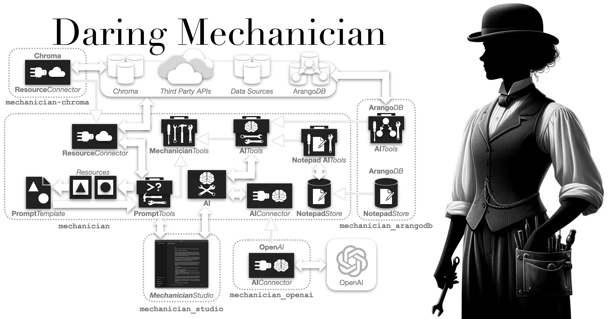

<p style="clear: both; margin-top: 0; font-family: 'Tratatello', serif; color: darkgrey;">

>*"...if they could only have found the point of application for it, they would have constructed a lever capable of raising the earth and rectifying its axis. It was just this deficiency which baffled these **daring mechanicians**."*  -Jules Verne, *From the Earth to the Moon* (1865)


The [**Daring Mechanician** ](https://mechanician.ai) project provides several Python packages for building Generative AI-enabled applications where the AIs themselves are provided tools to use, an approach that can be described as **Tool Augmented Generation** (**TAG**), and the tool-wielding Generative AIs can be described as **Tool Augmented Generative AIs** (**TAG AIs**).

The core `mechanician` package provides modules for building, testing, and tuning *TAG AIs* and the tools that these AIs use, including support for AI-driven testing and AI-assisted *tuning* of the instruction sets given to an AI that we call **Instruction Auto-Tuning** (IAT). 

The `mechanician-studio` package provides a multi-user web interface for interacting with the tool-equipped AIs.

The `mechanician-openai` package provides `AIConnectors` for both OpenAI's *Chat* API and *Assistants* API, and there are plans to create connectors for more LLMs with *tool-call* support, especially local LLMs.

The `mechanician-arangodb` package provides an example of `AITools` that let AIs interact with the [ArangoDB](https://arangodb.com) graph database.

The `mechanician-chroma` package provides an example of a `ResourceConnector` for the [Chroma](https://docs.trychroma.com) Embeddings database that enables `PromptTools` to use Chroma as a resource for `PromptTemplates`.


# Mechanician Studio

The `mechanician-studio` package provides a multi-user web interface where each user has their own personal instances of PromptTools and AIs equipped with AITools that can all be customized to each user. For instance in the following screenshot the user interacts with an AI with access to a user-specific Notepad tool that lets it read and take notes, providing a mechanism for the AI to remember details about the user across multiple interactions.


## Prompt Tools: CRM Query

In the following screenshot, the user uses Prompt Tools that let them create *prompts* using Prompt Templates that are populated by queries to a CRM system. After entering the query parameters and clicking the "Generate Prompt" button, the user is presented with the query results, referred to as Prompt Resources, and a *generated prompt* that merges these resources into the Prompt Template at the top of the screen. Clicking on the "Send Prompt" button sends the generated prompt to the AI, which then generates a response.


## Prompt Tools: Vector Database Query

In the following screenshots, the user uses Prompt Tools that let them create *prompts* using Prompt Templates that are populated by queries to a Chroma vector database.


Once the prompt has been generated you can *send* it to the AI, which will generate a response based on the prompt.


## Mechanician Studio Example

The `mechanician-studio` package provides a multi-user web interface for interacting with the tool-equipped AIs.

See the [Mechanician Studio Example](https://github.com/liebke/mechanician/tree/main/examples/studio_demo) for a demonstration of how to use the `mechanician-studio` package.


## MechanicianStudio Class

```python
from mechanician_studio import MechanicianStudio

MechanicianStudio(ai_provisioners=[ai_provisioner_notepad_only, ai_provisioner_tmdb],
                  prompt_tools_provisioners=[crm_tools_provisioner, 
                                             chroma_tools_provisioner])
```

## AIConnectorProvisioner Class

```python
from mechanician_openai import OpenAIChatConnectorProvisioner

OpenAIChatConnectorProvisioner(api_key=os.getenv("OPENAI_API_KEY"), 
                               model_name=os.getenv("OPENAI_MODEL_NAME"))
```

## AIProvisioner Class

```python
from mechanician import AIProvisioner

AIProvisioner(ai_connector_provisioner=ai_connector_provisioner,
              name = "TMDB AI",
              ai_tools_provisioners = [tmdb_tools_provisioner])
```

## AIToolsProvisioner Class

```python
from studio_demo.tmdb_ai_tools import TMDbAIToolsProvisioner

TMDbAIToolsProvisioner(api_key=os.getenv("TMDB_READ_ACCESS_TOKEN"))
```

See [tmdb_ai_tools.py](https://github.com/liebke/mechanician/blob/main/examples/studio_demo/src/studio_demo/tmdb_ai_tools.py) for More Details


## PromptToolsProvisioner Class

```python
from mechanician.tools import PromptToolsProvisioner
from studio_demo.chroma_prompt_tools import ChromaConnectorProvisioner

chroma_connector_provisioner = ChromaConnectorProvisioner(collection_name="studio_demo_collection")

chroma_tools_provisioner = PromptToolsProvisioner(resource_connector_provisioner = chroma_connector_provisioner,
                                                  prompt_template_directory="./templates",
                                                  prompt_instructions_directory="./src/instructions",
                                                  prompt_tool_instruction_file_name="rag_prompt_tool_instructions.json") 
```
See [chroma_prompt_tools.py](https://github.com/liebke/mechanician/blob/main/examples/studio_demo/src/studio_demo/chroma_prompt_tools.py) for More Details


## Run Mechanician Studio

```python
import uvicorn

uvicorn.run(init_studio(), 
            host="0.0.0.0", 
            port=8000,
            ssl_keyfile=os.getenv("SSL_KEYFILE"),
            ssl_certfile=os.getenv("SSL_CERTFILE"))
```
