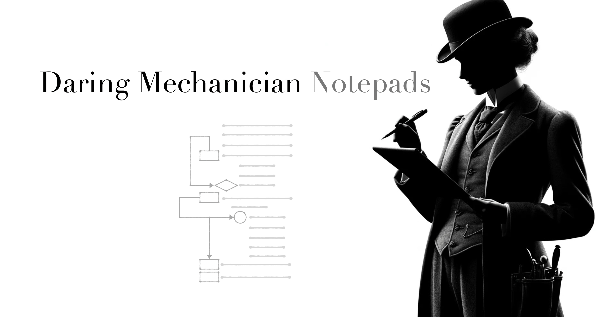

<p style="clear: both; margin-top: 0; font-family: 'Tratatello', serif; color: darkgrey;">

## Daring Mechanician Notepads

The focus of the [Daring Mechanician](https://mechanician.ai/daring-mechanician) project is on building tools that AIs themselves can use, and *notepads* are one of the oldest tools around. The ability to take notes is a broadly useful ability that can be applied in innumerable ways by both people and AIs to remember context across multiple conversations.

### Notepads Vs The ChatGPT Memory Feature

*Daring Mechanician* ***Notepads*** are inspired by the recent announcement by *OpenAI* of the [ChatGPT Memory](https://openai.com/blog/memory-and-new-controls-for-chatgpt) function, meant to let LLMs remember details about a user across different conversations.

*Notepads* provide this same memory functionality but in a way that provides additional flexibility in what is remembered in different contexts.


### Different Notepads for Different Contexts

A *Notepad* can be specific to a user, a project, an activity, a location, an AI tool set, or any other context that is useful to remember across multiple conversations.

* Store facts about the user or the user's environment.
* Capture user preferences for different tools used by the AI.
* Record timestamped results from different tools used by the AI.
* Create task lists for the AI, or user, removing items as they are completed.


### Notepads Tools

Telling the AI a fact will usually cause it to write a *note* in its *Notepad* or you can just ask it to remember something explicitly.

You can also ask the AI to
* List all the *notes* in its *Notepad*.
* Delete a *note*.
* Delete the entire *Notepad*.
* Get the current date and time, which can be useful for adding a timestamp to a *note*.


### What Notes Would an AI Take If an AI Could Take Notes?

*Notepads* are tools used by the AI, and only indirectly by users, to take notes on information of its choosing that it gathers during interactions with users.

It's interesting to see what information the AI chooses to note, how it chooses to represent it, and how it combines its notes with the other tools available to it.

* It will typically note facts told to it directly by the user
* It will sometimes note responses from tools it calls

* It will not always use the same representation for the same information across different conversations, for instance if it has noted a set of tasks to complete, it will usually remove items as they are completed, at least during the conversation in which the tasks were noted. If a task is completed during a subsequent conversation, it may not remove it from its *Notepad* but rather add a new note indicating that the task was completed; it will remove completed tasks when ask to though.


The way an AI uses a *Notepad* can be guided by the `ai_instructions` given to it at the outset of the conversation. You can choose to give explicit and clear instructions on how it should use its *Notepad*, or let the AI figure it out on its own, both approaches can be useful in different contexts.


### Combining Notepads with Other AITools

*Notepads* can be combined with other *AITools*, enabling the AI to pass facts from its notes as parameters to other tools without needing to prompt the user for the information.

For example, in the [Notepad Example project](https://github.com/liebke/mechanician/tree/main/examples/notepad), the AI is provided a *Notepad* and a *Middle Earth Weather* tool that requires a Middle-earth location and a non-Middle-earth date and returns a weather forecast.

So when prompted by a user with `does it look like its going to rain?`, If it knows the user lives in *Hobbiton* it will use that as the location, and since the weather tool stubbornly requires a date, and will not assume the current date as a default, the AI will use its *Notepad* to get the current date and time to pass to the weather tool.


#### Improving Preference Notes

The AI will note a user's preferences, but it can often require the user to remind the AI of the existence of the preference note during subsequent conversations.

One strategy to improve the personalization performance of the AI is to ask it to help you improve the wording of the note so that it will do a better job applying the preference when peforming tasks.

The best way to see how well your preferences have been captured by the AI is to end the current conversation and start a new one using the same *Notepad*.


## The Code

### Notepad Storage

Notepads can be stored in a local file or in an [ArangoDB](https://arangodb.com)  database, using the [NotepadFileStore](https://github.com/liebke/mechanician/blob/b2e9d1a57814d3351de1fe64fbd2d29bfed21ba7/packages/mechanician/src/mechanician/tools/notepads.py#L186) and [ArangoNotepadStore](https://github.com/liebke/mechanician/blob/main/packages/mechanician_arangodb/src/mechanician_arangodb/notepad_store.py) classes, respectively.

#### NotepadFileStore

```python
from mechanician.ai_tools.notepad import NotepadFileStore

notepad_store = NotepadFileStore(notepad_name=notepad_name,
                                 notepad_directory_name=notepad_directory_name)
```

#### ArangoNotepadStore

```python
from mechanician_arangodb.notepad_store import ArangoNotepadStore
from mechanician_arangodb import ArangoClient

database_name="test_notepad_db"
notepad_collection_name="notepads"
arango_client = ArangoClient(hosts=os.getenv("ARANGO_HOST"))
notepad_store = ArangoNotepadStore(notepad_name=notepad_name,
                                   arango_client=arango_client, 
                                   database_name=database_name,
                                   notepad_collection_name=notepad_collection_name,
                                   db_username=os.getenv("ARANGO_USERNAME"),
                                   db_password=os.getenv("ARANGO_PASSWORD"))
```

### NotepadAITools

The [NotepadAITools](https://github.com/liebke/mechanician/blob/b2e9d1a57814d3351de1fe64fbd2d29bfed21ba7/packages/mechanician/src/mechanician/tools/notepads.py#L250) class provides tools for AIs to interact with *Notepads*, and includes the following methods:

* create_note
* list_notes
* delete_note
* delete_notepad
* get_current_datetime


Import the `NotepadAITools` class from [mechanician.ai_tools.notepad](https://github.com/liebke/mechanician/blob/b2e9d1a57814d3351de1fe64fbd2d29bfed21ba7/packages/mechanician/src/mechanician/tools/notepads.py) and create an instance of it, passing the `notepad_store` to it.

```python
from mechanician.ai_tools.notepad import NotepadAITools

notepad_tools = NotepadAITools(notepad_store=notepad_store)
```

### Self-Explanatory AITools

The `NotepadAITools` class can be described as "self-explanatory", meaning it provides the `get_tool_instructions` and `get_ai_instructions` methods that will be used by the `TAGAI` class to retrieve the instructions sets.

This means that you don't need to pass the `ai_instructions` and `ai_tool_instructions` parameters to the `TAGAI` when initializing it, as it can get them directly from the `NotepadAITools` instance.

```python
from mechanician import TAGAI, shell

ai = TAGAI(ai_connector=ai_connector, 
           ai_tools=notepad_tools,
           name="Notepad-Enabled AI")

shell.run(ai)
```


### Passing Multiple AITools to a TAGAI

You can now pass a list of self-explanatory *AITools* to the *TAGAI* class using the `tools` parameter.

```python
from ex_tools import MiddleEarthWeatherAITools

weather_tools = MiddleEarthWeatherAITools()

ai = TAGAI(ai_connector=ai_connector, 
           ai_tools=[notepad_tools, weather_tools],
           name="Notepad-Enabled AI")
```

Each instance of `AITools` should use the same "self-explanatory" approach as `NotepadAITools`.


### Writing Self-Explanatory AITools

When creating new sub-classes of [AITools](https://github.com/liebke/mechanician/blob/main/packages/mechanician/src/mechanician/ai_tools.py), you will want to provide both the `ai_instructions` and `ai_tool_instructions` so that the `TAGAI` class can successfully provide instructions to the AI on how to use your tools.

You can do this by:

* Including the class variables, `ai_instructions` and `ai_tool_instructions` directly.

* Including the class variables `instruction_set_directory`, `ai_instruction_file_name`, and `tool_instruction_file_name` indicating where the instruction files can be found

* Just placing the respective instruction files in the default locations, `./instructions/ai_instructions.md` and `./instructions/ai_tool_instructions.json`.


The default `get_ai_instructions` and `get_tool_instructions` methods of the `AITools` class will:

* Look for the existence of either `self.ai_instructions` or `self.ai_tool_instructions` and return those if they exist.

* Otherwise they will look for the exitence of `self.instruction_set_directory`, `self.tool_instruction_file_name`, and `self.ai_instruction_file_name` and use those to read the instructions for their respective files. 
 
* But if none of those exist, they will use the default values of `./instructions` for the `instruction_set_directory` and `ai_tool_instructions.json` and `ai_instructions.md` for the `ai_tool_instructions_file_name` and `ai_instruction_file_name`, respectively, 
 
* Finally, if the `instruction_set_directory` doesn't exist, `get_ai_instructions` will return an empty string and `get_tool_instructions` will return an empty list.


## The Notepads Example Project

See the [Notepad Example](https://github.com/liebke/mechanician/tree/main/examples/notepad) for more details on how to use the *Notepads* tools.


### Install

Create a virtual environment and install the requirements.

```bash
conda create -n notepad_ex_env python=3.11
conda activate notepad_ex_env
```

Install the example project using pip:

```bash
pip install -e .
```

### Run the AI Shell

```bash
./scripts/run.sh --notepad "my_notepad"
```


## Exit the Virtual Environment and Clean Up

Exit the virtual environment and remove it when you are done.

```bash
conda deactivate
conda remove --name notepad_ex_env --all
```


