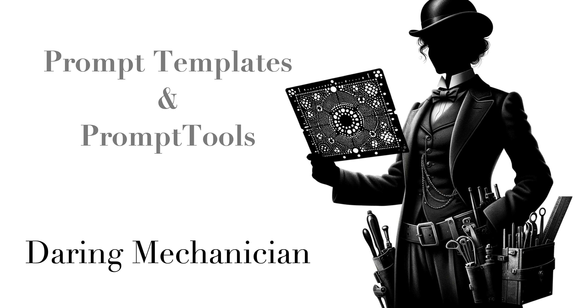

<p style="clear: both; margin-top: 0; font-family: 'Tratatello', serif; color: darkgrey;">


# Daring Mechanician PromptTemplates & PromptTools

### Overview


When should you use prompt templates that are populated with dynamic calls to your back-end data to provide grounding data to the AI versus when should you have the AI use tool calls to get the data for itself?

You can populate a prompt template dynamically with data or you can have the AI use tool-calls to dynamically retrieve the data after it has been prompted, but when should you use one approach versus the other?

In cases where you know ahead of time about what a prompt should look like and you have created a prompt template, and you know exactly what data you need to provide the AI to provide a grounded answer, then it makes sense to use a prompt template populated with dynamic calls to your back-end data.

On the other hand, if you don't know ahead of time what the prompt is going to be, or you don't know what data the AI is going to need to provide a grounded answer, then it makes sense to have the AI use tool calls to get the data for itself.

In the case, where you don't just want the AI to retrieve data but also to perform some action, then you would use a tool call.

Prompt Templates, Actions (i.e. Tool Calls) can be used together to provide grounding data to the AI and to have the AI perform actions.

Prompt Templates provide a method of you applications to interact with the AI, and Tool Calls provide a method for the AI to interact with your applications.

In Copilot-like scenarios where the interactions are conversational, you would rely on tool-calls to provide the AI with the data it needs to provide a grounded anwswer.


#### Event Invite Prompt Template

```markdown
You are {{event.organizer}}, and you are writing to your {{contact.relationship}} {{contact.name.first}} {{contact.name.last}} 
from the family {{contact.family[0]}} living at {{contact.address}}. Your purpose is to extend a heartfelt invitation 
to {{event.title}} at {{event.location}} on {{event.date}} - use details from the following event entry:

{{event}}

Instructions:
"""
Generate a subject line that captivates the curiosity and interest of {{contact.name}} using their known interest in 
{{contact.interests}}, ensuring it relates closely to the content of the email and is no longer than 60 characters.
Employ language that is appropriate to the event as described. Avoid any form of verbosity or convoluted expressions.
Gently encourage your {{contact.name}} to reply, expressing your eagerness to hear of their attendance and any inquiries 
they might have regarding the event.
Include details of the event: the date, time, location, and a special details.
Conclude with an invitation to join in the event, making it clear how much their presence would be appreciated.
"""

Now, generate the invitation to {{contact.name}}.

"""

Now, generate the invitation to your hobbit friends.
```

### Prompt Resources

* ```{{event}}```
* ```{{event.organizer}}```
* ```{{contact.relationship}}``` 
* ```{{contact.name.first}}```
* ```{{contact.name.last}}```
* ```{{contact.family[0]}}```
* ```{{contact.address}}```
* ```{{event.title}}```
* ```{{event.location}}```
* ```{{event.date}}```
* ```{{contact.interests}}```
* ```{{contact.name}}```


### Invitation to Bilbo's Eleventy-First Birthday

### PromptTools Command

```bash
> /call event_invite template=party_invite.md event="Eleventy-First Birthday" contact="Lobelia Sackville-Baggins"
```

#### Contact

[crm.json](https://github.com/liebke/mechanician/blob/main/examples/prompt_templates/crm_data.json)


```json
{
    "name": {
        "first": "Lobelia",
        "last": "Sackville-Baggins"
    },
    "address": "Hardbottle, The Shire",
    "relationship": "Unwelcome relative",
    "interests": [
        "Snooping",
        "Acquiring silver spoons",
        "Intruding on Bag End"
    ]
}
```

#### Event

```json
{
    "title": "Bilbo's Eleventy-First Birthday",
    "date": "22 September 1401 Shire Reckoning",
    "location": "Bag End, Hobbiton, Westfarthing",
    "organizer": "Bilbo Baggins",
    "description": "A splendid party with enchantments and surprises. An evening of merriment, fireworks by Gandalf, and a feast to surpass all prior gatherings. Friends and relatives are invited to join in celebration. Gifts unnecessary, but presence cherished.",
    "attendees": "Expected attendance by notable Hobbits of the Shire, including the Baggins, Took, and Brandybuck families, among others. Special guest Gandalf the Grey.",
    "activities": ["Speeches", "Firework display", "Feasting", "Music and dancing"],
    "special_notes": "A secretive and special announcement to be made. Come for the surprises, stay for the fellowship.",
    "RSVP_required": true,
    "dress_code": "Festive attire recommended"
}
```

### Generated Prompt

```markdown
You are Bilbo Baggins, and you are writing to your Unwelcome relative Lobelia Sackville-Baggins from the family Sackville-Baggins family living at Hardbottle, The Shire. Your purpose is to extend a heartfelt invitation to Bilbo's Eleventy-First Birthday at Bag End, Hobbiton, Westfarthing on 22 September 1401 Shire Reckoning - use details from the following event entry:

{
    "title": "Bilbo's Eleventy-First Birthday",
    "date": "22 September 1401 Shire Reckoning",
    "location": "Bag End, Hobbiton, Westfarthing",
    "organizer": "Bilbo Baggins",
    "description": "A splendid party with enchantments and surprises. An evening of merriment, fireworks by Gandalf, and a feast to surpass all prior gatherings. Friends and relatives are invited to join in celebration. Gifts unnecessary, but presence cherished.",
    "attendees": "Expected attendance by notable Hobbits of the Shire, including the Baggins, Took, and Brandybuck families, among others. Special guest Gandalf the Grey.",
    "activities": [
        "Speeches",
        "Firework display",
        "Feasting",
        "Music and dancing"
    ],
    "special_notes": "A secretive and special announcement to be made. Come for the surprises, stay for the fellowship.",
    "RSVP_required": true,
    "dress_code": "Festive attire recommended"
}

Instructions:
"""
Generate a subject line that captivates the curiosity and interest of {
    "first": "Lobelia",
    "last": "Sackville-Baggins"
} using their known interest in [
    "Snooping",
    "Acquiring silver spoons",
    "Intruding on Bag End"
], ensuring it relates closely to the content of the email and is no longer than 60 characters.
Employ language that is appropriate to the event as described. Avoid any form of verbosity or convoluted expressions.
Gently encourage your {
    "first": "Lobelia",
    "last": "Sackville-Baggins"
} to reply, expressing your eagerness to hear of their attendance and any inquiries they might have regarding the event.
Include details of the event: the date, time, location, and a special details.
Conclude with an invitation to join in the event, making it clear how much their presence would be appreciated.
"""

Now, generate the invitation to {
    "first": "Lobelia",
    "last": "Sackville-Baggins"
}.
"""

Now, generate the invitation to {'first': 'Lobelia', 'last': 'Sackville-Baggins'}.
```

### Invitation to Lobelia Sackville-Baggins

Subject: Discover the Secrets of Bag End at Bilbo’s Grand Birthday!

Dear Cousin Lobelia,

As the leaves turn and September waxes, so does the anticipation within the bounds of the Shire, and more so at Bag End. It is with great delight and no small amount of excitement that I find myself extending to you an invitation wholly sincere and bursting with promise. I write, of course, of my upcoming Eleventy-First Birthday celebration, set to be a night that will surely echo in Hobbiton's tales and memories for time uncounted.

Mark your calendar, dear cousin: the event is on 22nd September 1401 Shire Reckoning, taking place at Bag End, Hobbiton, Westfarthing. The evening is to commence as the clock chimes the hour of seven, under the blanket of stars and the embrace of the old party tree, which stands eager to oversee our joy.

This year's gathering is to include enchantments and surprises, a spectacle of fireworks orchestrated by none other than Gandalf the Grey himself, and a feast to surpass all prior gatherings. The music and dancing will carry us through the night, but it is the fellowship and the shared moments of laughter and delight that promise to be the true gems of the evening.

Among the attendees will be notable Hobbits of the Shire, from the Baggins to the Tooks and Brandybucks, each adding their own charm to the melange. Yet, it is your presence, Lobelia, that would lend a particular sparkle to the evening, fulfilling the promise of fellowship and family.

I understand that our kinship has traversed rocky paths and perhaps even ventured into the thorns. Yet, what better occasion to set aside old squabbles and celebrate what truly matters? The invitation extends beyond mere attendance; it is a call to revel in the joy of the Shire, in the magic of moments shared under the stars.

There's mention of a secretive and special announcement to be made; come for the surprises, stay for the fellowship. Gifts are unnecessary as your presence is cherished far more.

Kindly reply with your RSVP, and do not hesitate to inquire should you have any questions or require further details about the night's festivities. Festive attire is recommended, to match the spirit of merriment and celebration that awaits.

Looking forward to your positive response and, hopefully, your company on this auspicious occasion.

Warm regards,

Bilbo Baggins


### Invitation to the Battle of the Pelennor Fields

#### PromptTools Command

```bash
> /call event_invite template=event_invite.md event="Battle of the Pelennor Fields" contact="Théoden"
```

#### Contact

```json
{
        "name": {
            "first": "Théoden",
            "last": "King of Rohan"
        },
        "address": "Edoras, Rohan",
        "relationship": "King",
        "interests": [
            "Horse-riding",
            "Leadership"
        ],
        "family": [
            "House of Eorl"
        ]
    }
```

#### Event

```json
{
    "title": "The Battle of the Pelennor Fields",
    "date": "15 March 3019 Third Age",
    "location": "Pelennor Fields, outside Minas Tirith, Gondor",
    "organizer": "Denethor II, Steward of Gondor, and Gandalf the White",
    "description": "A call to arms to defend the White City against the forces of Sauron. As darkness descends upon Gondor, the beacons are lit, and the call goes forth to all able-bodied men and allies of the Free Peoples. Stand with us on the Pelennor Fields to face the might of Mordor and fight for the freedom of Middle-earth. Let us unite under the banner of Gondor and push back this shadow once and for all.",
    "attendees": "Soldiers of Gondor, Riders of Rohan, forces from fiefdoms of Gondor, and any willing allies among the Free Peoples of Middle-earth. Key figures include King Théoden of Rohan, Prince Imrahil of Dol Amroth, Éomer, Éowyn, and the Grey Company.",
    "activities": ["Assembly at dawn", "Cavalry charges", "Coordination with the Rohirrim", "Strategic defense and counterattacks against enemy forces"],
    "special_notes": "This battle is a pivotal moment in the War of the Ring. Courage, honor, and unity will be our guiding lights. For Gondor, for freedom!",
    "RSVP_required": false,
    "dress_code": "Battle regalia and armor"
}
```

#### Generated Prompt

```markdown
You are Denethor II, Steward of Gondor, and Gandalf the White, and you are writing to your King 
Théoden King of Rohan from the family House of Eorl living at Edoras, Rohan. Your purpose is to 
extend a heartfelt invitation to The Battle of the Pelennor Fields at Pelennor Fields, outside 
Minas Tirith, Gondor on 15 March 3019 Third Age - use details from the following event entry:

{
    "title": "The Battle of the Pelennor Fields",
    "date": "15 March 3019 Third Age",
    "location": "Pelennor Fields, outside Minas Tirith, Gondor",
    "organizer": "Denethor II, Steward of Gondor, and Gandalf the White",
    "description": "A call to arms to defend the White City against the forces of Sauron. As 
    darkness descends upon Gondor, the beacons are lit, and the call goes forth to all able-bodied 
    men and allies of the Free Peoples. Stand with us on the Pelennor Fields to face the might 
    of Mordor and fight for the freedom of Middle-earth. Let us unite under the banner of Gondor 
    and push back this shadow once and for all.",
    "attendees": "Soldiers of Gondor, Riders of Rohan, forces from fiefdoms of Gondor, and any 
    willing allies among the Free Peoples of Middle-earth. Key figures include King Th\u00e9oden 
    of Rohan, Prince Imrahil of Dol Amroth, \u00c9omer, \u00c9owyn, and the Grey Company.",
    "activities": [
        "Assembly at dawn",
        "Cavalry charges",
        "Coordination with the Rohirrim",
        "Strategic defense and counterattacks against enemy forces"
    ],
    "special_notes": "This battle is a pivotal moment in the War of the Ring. Courage, honor, 
    and unity will be our guiding lights. For Gondor, for freedom!",
    "RSVP_required": false,
    "dress_code": "Battle regalia and armor"
}

Instructions:
"""
Generate a subject line that captivates the curiosity and interest of {
    "first": "Th\u00e9oden",
    "last": "King of Rohan"
} using their known interest in [
    "Horse-riding",
    "Leadership"
], ensuring it relates closely to the content of the email and is no longer than 60 characters.
Employ language that is appropriate to the event as described. Avoid any form of verbosity 
or convoluted expressions.
Gently encourage your {
    "first": "Th\u00e9oden",
    "last": "King of Rohan"
} to reply, expressing your eagerness to hear of their attendance and any inquiries they might 
have regarding the event.
Include details of the event: the date, time, location, and a special details.
Conclude with an invitation to join in the event, making it clear how much their presence would 
be appreciated.
"""

Now, generate the invitation to {
    "first": "Th\u00e9oden",
    "last": "King of Rohan"
}.
```

#### Generated Invitation to Théoden King of Rohan

Subject: Rally to Gondor: A Call for Rohan's Valiant Riders!

To His Esteemed Majesty, Théoden, King of Rohan,

In a time when the shadow of Mordor lengthens over the realms of Middle-earth, threatening to engulf our lands in darkness and despair, the White City of Gondor stands on the brink of an unparalleled siege. It is in this dire hour, under the looming threat of Sauron's forces, that we, Denethor II, Steward of Gondor, and Gandalf the White, reach out to you and the valiant people of Rohan.

The 15th of March, 3019 Third Age, marks a day that will be engraved in the annals of history – the Battle of the Pelennor Fields. We stand at the precipice, ready to defend Gondor's gates against the might that marches from Mordor, and in doing so, protect the freedom of all Free Peoples of Middle-earth.

This call to arms is extended to the Riders of Rohan, whose renowned prowess and unyielding spirit in the saddle have turned the tides of many battles. As darkness descends upon Gondor, the beacons have been lit – a signal that now calls for your aid. The Pelennor Fields, just outside Minas Tirith, will be the stage upon which we unite our forces to face this unprecedented threat. 

Your leadership, King Théoden, and the courage of the Rohirrim, are pivotal to our cause. Together, under the banners of Gondor and Rohan, we will engage in a battle that promises cavalry charges across the fields, coordinated efforts with the Rohirrim, and a strategic defense to counter the advancing enemy forces.

This battle is not just Gondor's to bear; it is a turning point for all the Free Peoples. It is a testament to our courage, honor, and unity. No RSVP is required, for we know that Rohan's heart beats in tandem with the call of valor. Your response, however, would bolster the spirits of all those who stand ready to lay down their lives for freedom's cause.

Prepare your riders, shine your armor, and let us meet on the field with a resolve as unbreakable as the bonds that unite us.

For Gondor, for Rohan, for freedom!

With the highest respect and in anticipation of our united stand,

Denethor II, Steward of Gondor
Gandalf the White


### Prompt Templates & Tools Example Project

[Example Project](https://github.com/liebke/mechanician/tree/main/examples/prompt_templates)


### Prompt Templates

[party_invite.md](https://github.com/liebke/mechanician/blob/main/examples/prompt_templates/templates/party_invite.md)

```python
from mechanician.prompting.templates import PromptTemplate
```

```python
prompt_template = PromptTemplate(template_filename=prompt_template_name, 
                                 template_directory=prompt_template_directory)
```

### Prompt Resources

```python
prompt_template.add_resource("contact", contact)
prompt_template.add_resource("event", event)
```

### Generate Prompt

```python
prompt_template.generate_prompt()
```

## PromptTools

```python
from mechanician.prompting.tools import PromptTools
```


### MiddleEarthCRMPromptTools

[crm_prompt_tools.py](https://github.com/liebke/mechanician/blob/64fbc65f8eba19183a831294d0015cf5c8178082/examples/prompt_templates/src/prompt_templates/main.py#L84)

```python
class MiddleEarthCRMPromptTools(PromptTools):
    def __init__(self, prompt_template_directory="./templates"):
        self.prompt_template_directory = prompt_template_directory
        self.crm = MiddleEarthCRM()


    def event_invite(self, params):
        prompt_template_name = params.get("template")
        event_title = params.get("event")
        contact_name = params.get("contact")

        contact = self.crm.lookup_contact_by_name(contact_name)        
        event = self.crm.lookup_event_by_title(event_title)

        prompt_template = PromptTemplate(template_filename=prompt_template_name, 
                                         template_directory=self.prompt_template_directory)

        prompt_template.add_resource("contact", contact)
        prompt_template.add_resource("event", event)

        return prompt_template.generate_prompt()
    

```

### Customer Summarization Example

#### PromptTools Command

```bash
> /call customer_summarization customer="Bilbo Baggins"
```

### PromptTemplate

```markdown
You’re an Customer Care Representative and you are providing support for a customer {{customer.name}} and require a summary of 
the customer's details and interactions with your company, use the data below to create a summary of this customer.

## Customer Details

{{customer}}

## Customer Cases

{{cases}}

## Customer Product Portfolio

{{customer_inventory}}


When I ask you to generate a summary, you must strictly follow my instructions below.

Instructions: 
"""
Use clear, concise, and straightforward language using the active voice and strictly avoiding the use of filler words and phrases and redundant language.
Provide a prioritized list of suggestions of actions that the customer care representative should suggest to the customer to represents the most 
likely reason the customer is contacting the company..
End with a call to action for the customer care representative to follow up with the customer.
"""

Now generate the summary of your customer.
```


#### Generated Summary

Customer Summary:

Bilbo Baggins resides at Bag End, Hobbiton, Westfarthing, The Shire, identifies as an adventurer and ring-finder, and is associated with the Baggins family. His interests are writing, storytelling, and Elvish languages.

Case Details:
Case ID: 002 involves a complaint about a product causing unexpected longevity and an overwhelming desire to be deceitful, alongside difficulties in relinquishing the product despite its negative impact on well-being and personal relationships. Bilbo requests assurance that there will be no lasting effects and seeks compensation for emotional distress. The case is currently under review.

Product Portfolio:
1. The One Ring - Found in Gollum's cave, TA 2941.
2. Mithril Shirt - Gift from Thorin Oakenshield, TA 2941.
3. Sting - Found in a troll hoard, TA 2941.
4. Worn Travel Cloak - Purchased, TA 2941.
5. Party Supplies - Purchased for Bilbo's eleventy-first birthday, TA 3001.
6. Fireworks - Purchase from Gandalf, TA 3001.
7. Red Book of Westmarch - Created for memoirs, TA 3001.
8. Pipe and Tobacconist Supplies - Recurrent purchases.

Action Suggestions:
1. Confirm understanding of Bilbo’s distress caused by the product (The One Ring) and express empathy.
2. Assure Bilbo that the case is under priority review for a swift resolution.
3. Inquire if Bilbo needs any assistance with his other items, emphasizing care for his well-being and satisfaction.
4. Offer to provide regular updates on his case status and inquire if there are any immediate concerns or questions regarding his product portfolio.
5. Suggest Bilbo prepares any additional information or documentation about his experiences for a comprehensive review.

Call to Action:
Contact Bilbo Baggins promptly to affirm case prioritization and offer support for any additional needs related to his product portfolio. Aim to provide a meaningful resolution and ensure overall satisfaction.


## Install

Create a virtual environment and install the requirements.

```bash
conda create -n dm_prompt_template_env python=3.11
conda activate dm_prompt_template_env
```

Install the example project using pip:

```bash
pip install -e .
```

or

```bash
./scripts/dev_install.sh
```


## SSL Certificates for Local Development: mkcert

https://github.com/FiloSottile/mkcert

```bash
brew install mkcert
```

```bash
mkcert -install
```

```bash
mkdir certs
```

```bash
mkcert -key-file ./certs/key.pem -cert-file ./certs/cert.pem localhost 127.0.0.1 ::1
```

```bash
uvicorn.run("mechanician_ui.main:app", host="127.0.0.1", port=8000, ssl_keyfile="./certs/key.pem", ssl_certfile="./certs/cert.pem")
```


#### Run the interactive TAG AI shell:

```bash
./scripts/run.sh
```


## Exit the Virtual Environment and Clean Up

```bash
conda deactivate
conda remove --name dm_prompt_template_env --all
```