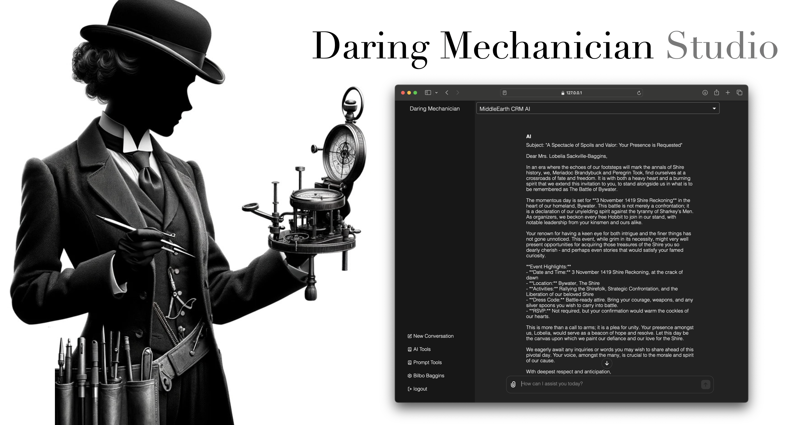

<p style="clear: both; margin-top: 0; font-family: 'Tratatello', serif; color: darkgrey;">


# Daring Mechanician AI Studio Demo


## Install

Create a virtual environment and install the requirements.

```bash
conda create -n studio_demo_env python=3.11
conda activate studio_demo_env
```

Install the example project using pip:

```bash
pip install -e .
```

or

```bash
./scripts/dev_install.sh
```


## SSL Certificates for Local Development: mkcert

https://github.com/FiloSottile/mkcert

```bash
brew install mkcert
```

```bash
mkcert -install
```

```bash
mkdir certs
```

```bash
mkcert -key-file ./certs/key.pem -cert-file ./certs/cert.pem localhost 127.0.0.1 ::1
```

### Start the Chroma Database

```bash
docker run -p 8080:8000 chromadb/chroma
```

OR

## Run Chroma in Docker (with persistence)

```bash
git clone https://github.com/chroma-core/chroma.git
cd chroma
docker compose up --build
```

### Start the Arango Database

Set your environment variables:

```bash
ARANGO_ROOT_PASSWORD=<YOUR_ARANGODB_ROOT_PASSWORD>
ARANGO_HOST=http://localhost:8529
```

```bash
docker pull arangodb/arangodb
```

```bash
docker run -e ARANGO_ROOT_PASSWORD=${ARANGO_ROOT_PASSWORD} -p 8529:8529 -d --name arangodb-instance arangodb/arangodb
```

```bash
docker start arangodb-instance
```


#### Run the Mechanician AI Studio:

```bash
python3 -m studio_demo.main
```


## Exit the Virtual Environment and Clean Up

```bash
conda deactivate
conda remove --name studio_demo_env --all
```

```bash
docker stop arangodb-instance
```