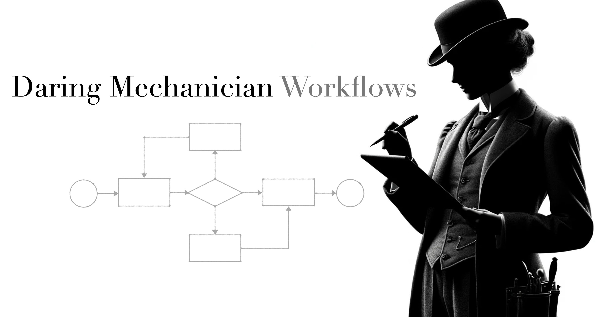

<p style="clear: both; margin-top: 0; font-family: 'Tratatello', serif; color: darkgrey;">


# Daring Mechanician Workflows Example


## Install

Create a virtual environment and install the requirements.

```bash
conda create -n dm_workflows_env python=3.11
conda activate dm_workflows_env
```

Install the example project using pip:

```bash
pip install -e .
```

#### Run the interactive TAG AI shell:

```bash
./scripts/run.sh
```

### Run the AI-Driven tests:

```bash
./scripts/test.sh
```


## Exit the Virtual Environment and Clean Up

```bash
conda deactivate
conda remove --name dm_workflows_env --all
```