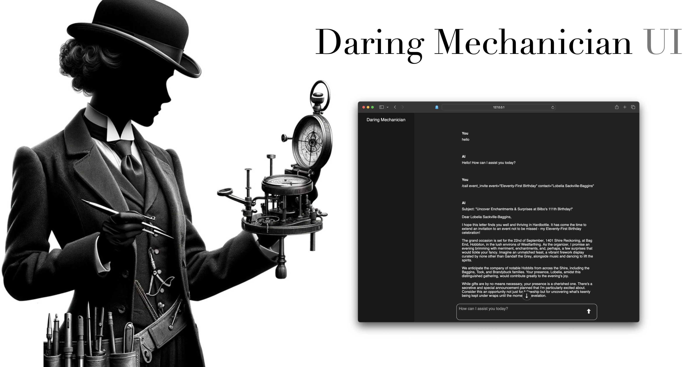

<p style="clear: both; margin-top: 0; font-family: 'Tratatello', serif; color: darkgrey;">

# Daring Mechanician-UI

This package provides the **Daring Mechanician** FastAPI-based user interface.

See [Daring Mechanician Github Repo](https://github.com/liebke/mechanician) for more information.


## SSL Certificates for Local Development: mkcert

https://github.com/FiloSottile/mkcert

```bash
brew install mkcert
```

```bash
mkcert -install
```

```bash
mkdir certs
```

```bash
mkcert -key-file ./certs/key.pem -cert-file ./certs/cert.pem localhost 127.0.0.1 ::1
```

```bash
uvicorn.run("mechanician_ui.main:app", host="127.0.0.1", port=8000, ssl_keyfile="./certs/key.pem", ssl_certfile="./certs/cert.pem")
```